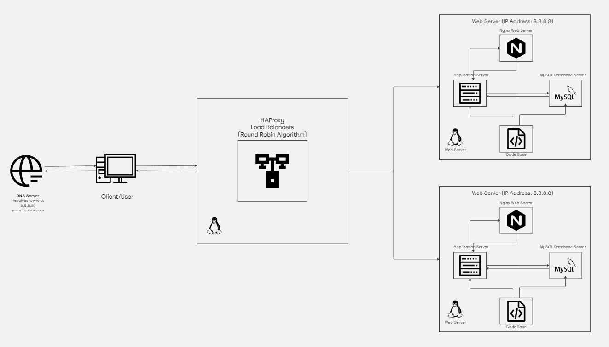

# Distributed Web Infrastructure

## Infrastructure Design

The provided image illustrates a distributed three-server web infrastructure that hosts the website www.foobar.com. This infrastructure includes multiple components to enhance scalability, reliability, and performance. Below is an explanation of each component and its role:

1. **User's Computer**:
   - Represents the device from which a user accesses the website.

2. **Domain Name (foobar.com)**:
   - Acts as the human-readable alias for the server's IP addresses.
   - Allows users to access the website using the memorable name www.foobar.com.

3. **DNS Server**:
   - Resolves domain names to IP addresses.
   - Maps the domain foobar.com to the IP addresses of the load balancers.

4. **Load Balancer (HAProxy)**:
   - Distributes incoming traffic across multiple servers to ensure load distribution and high availability.
   - Enables scalability by adding or removing servers dynamically.
   - Adds redundancy to mitigate the risk of a single point of failure.

5. **Web Server (Nginx)**:
   - Handles incoming HTTP requests from clients.
   - Serves static content efficiently and can act as a reverse proxy for dynamic content.
   - Each server in the infrastructure hosts an instance of Nginx to serve web content.

6. **Application Server**:
   - Executes application logic and generates dynamic content based on user requests.
   - Hosts the application codebase.
   - Each server in the infrastructure hosts an instance of the application server.

7. **Database (MySQL)**:
   - Stores and manages website data, such as user accounts, content, and configurations.
   - Utilizes a Primary-Replica (Master-Slave) cluster for high availability and fault tolerance.

## Explanation of Specifics

- **Load Balancer**: 
  - Added to distribute incoming traffic across multiple servers, enhancing scalability and availability.
  - Configured with a round-robin distribution algorithm, evenly distributing requests among servers.

- **Active-Active vs. Active-Passive Setup**:
  - The load balancer enables an Active-Active setup where all servers actively handle incoming requests simultaneously.
  - In contrast, an Active-Passive setup involves one server actively handling requests while the others remain on standby until needed.

- **Primary-Replica Database Cluster**:
  - The database cluster comprises a Primary node (Master) and one or more Replica nodes (Slaves).
  - The Primary node handles write operations, while Replica nodes replicate data from the Primary node and handle read operations.
  
- **Difference Between Primary and Replica Nodes**:
  - The Primary node accepts write operations and is responsible for maintaining the database's integrity.
  - Replica nodes replicate data from the Primary node and serve read-only operations, enhancing scalability and fault tolerance.

## Issues with the Infrastructure

1. **Single Point of Failure (SPOF)**:
   - Although the load balancer adds redundancy, it remains a single point of failure. Implementing multiple load balancers in a high-availability setup would mitigate this risk.

2. **Security Issues**:
   - Lack of firewall and HTTPS implementation leaves the infrastructure vulnerable to security threats. Implementing a firewall and enabling HTTPS encryption would enhance security.

3. **No Monitoring**:
   - Absence of monitoring tools makes it challenging to identify and address performance issues or failures promptly. Implementing monitoring solutions would enable proactive management of the infrastructure.
