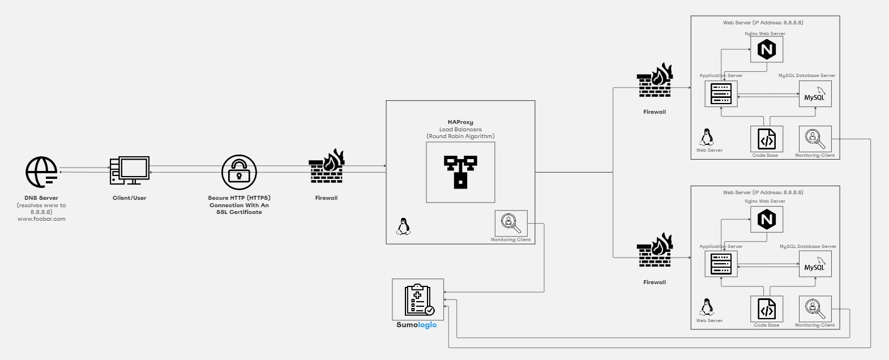

# Secured and Monitored Web Infrastructure

## Infrastructure Design

The provided image illustrates a three-server web infrastructure hosting the website www.foobar.com. This infrastructure is designed to be secured, serve encrypted traffic over HTTPS, and be monitored for performance and security.

### Components:

1. **Firewalls (3)**:
   - Implemented to control and monitor incoming and outgoing network traffic.
   - Enhance security by filtering malicious traffic and unauthorized access attempts.

2. **SSL Certificate**:
   - Used to enable HTTPS, ensuring secure communication between clients and the web servers.
   - Encrypts data transmitted over the network, preventing interception and tampering.

3. **Monitoring Clients (3)**:
   - Deployed to collect data on system performance, resource usage, and security events.
   - Facilitates proactive monitoring and troubleshooting to maintain availability and reliability.

## Specifics Explanation:

- **Firewalls**: Added to enforce security policies and protect against unauthorized access, malware, and other threats.

- **HTTPS Traffic**: HTTPS encrypts data transmission, safeguarding sensitive information and preventing eavesdropping and data tampering.

- **Monitoring Purpose**: Monitoring tools are used to track system health, identify performance bottlenecks, and detect security breaches.

- **Data Collection by Monitoring Tool**: The monitoring tool collects data from various sources such as server logs, system metrics, and network traffic.

- **Monitoring Web Server QPS**:
  - Monitor the request rate (Queries Per Second) of the web server by analyzing web server logs or using built-in monitoring features of the web server software.

## Issues with the Infrastructure:

1. **Terminating SSL at the Load Balancer Level**:
   - Terminating SSL at the load balancer exposes decrypted traffic within the internal network, potentially compromising security.

2. **Single MySQL Server for Writes**:
   - Having only one MySQL server capable of accepting writes creates a single point of failure for write operations and may impact availability.

3. **Uniform Components Across Servers**:
   - Using identical components (database, web server, and application server) on all servers increases homogeneity, making the infrastructure vulnerable to widespread failures and exploits.

