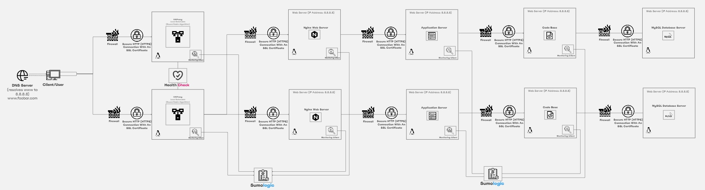

# Scale Up

## Infrastructure Design

The provided image illustrates a scaled-up web infrastructure designed to improve performance and scalability by splitting components across multiple servers and implementing load balancing.

### Components:

1. **Server (1)**:
   - Hosts the various components of the web infrastructure.
   
2. **Load Balancer (HAproxy)**:
   - Configured as a cluster with another load balancer for redundancy and high availability.
   - Distributes incoming traffic across multiple servers to optimize performance and handle increased load.

3. **Split Components**:
   - Web Server: Responsible for handling HTTP requests and serving static content.
   - Application Server: Executes application logic and generates dynamic content.
   - Database: Stores and manages website data.

## Specifics Explanation:

- **Server Addition**: Adding another server allows for the separation of components, improving scalability, fault tolerance, and performance isolation.

- **Load Balancer Cluster**: Clustering load balancers provides redundancy and ensures continuous availability in case of a failure.

- **Splitting Components**:
  - Web Server: Dedicated to serving web pages and static content, optimizing performance by offloading this task from the application server.
  - Application Server: Handles application logic and dynamic content generation, allowing for better resource utilization and scalability.

## Issues with the Infrastructure:

- **Complexity**:
   - The addition of multiple servers and load balancers increases the complexity of the infrastructure, requiring careful configuration and management to ensure smooth operation.
