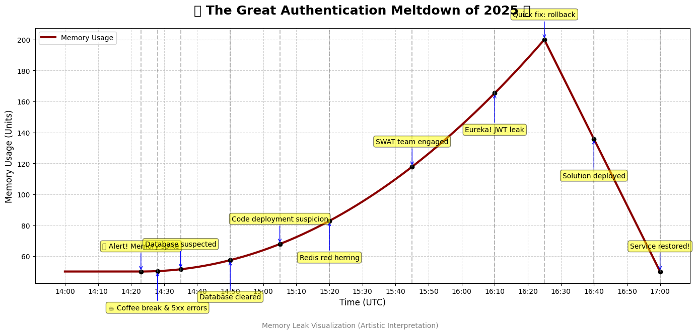

# 🔥 The Great Authentication Meltdown of 2025 🔥

## Issue Summary
- **Duration**: 2 hours and 37 minutes of pure chaos (14:23-17:00 UTC, Feb 18, 2025)
- **Impact**: 73% of users locked out faster than you can say "Have you tried turning it off and on again?" Active users were spontaneously logged out, new users couldn't create accounts, and our error logs were having a party.
- **Root Cause**: A sneaky memory leak in our authentication service caused by a promise that, like my ex, made commitments it couldn't keep after we updated its dependency.

## Timeline (A Tragic Comedy in One Act)
- **14:23 UTC** - 🚨 Alert! Memory usage on auth servers spiking higher than a Silicon Valley startup's valuation.
- **14:28 UTC** - On-call engineer's coffee break rudely interrupted by cascade of 5xx errors.
- **14:35 UTC** - Initial suspect: The database (it's always the database, right?). Spoiler alert: it wasn't.
- **14:50 UTC** - Database proven innocent after thorough interrogation. The plot thickens.
- **15:05 UTC** - Suspicious eyes turn to yesterday's code deployment. "What did v2.5.7 do this time?"
- **15:20 UTC** - Red herring alert! Team went down Redis rabbit hole. Redis was just an innocent bystander.
- **15:45 UTC** - "We need backup!" Incident escalated to the Backend Infrastructure SWAT team.
- **16:10 UTC** - Eureka! Culprit identified: JWT verification function leaking memory like a sieve.
- **16:25 UTC** - Quick fix deployed: Dependency rolled back faster than you can say "git revert".
- **16:40 UTC** - Solution cautiously deployed to production. Engineers holding breath.
- **17:00 UTC** - Service restored! High-fives exchanged. Incident report writing commenced.

*Fig 1: What our memory usage looked like (artistic interpretation)*

## Root Cause: The Technical Autopsy
Remember that innocent-looking dependency update to `auth-token-validator` (3.2.1 → 3.3.0)? Turns out it was about as innocent as leaving a toddler alone with a chocolate cake. The update changed how promise rejections were handled, leaving zombie memory allocations with each failed token verification.

As more users tried to authenticate, these memory zombies multiplied, eventually causing our Node.js instances to hit their limits and dramatically crash. Our auto-recovery system valiantly tried to restart instances, but they'd quickly fill with memory zombies again. It was like trying to bail out the Titanic with a teacup.

## The Solution: How We Slayed the Memory Zombies
We performed the classic "turn it off and on again" maneuver by rolling back to the previous dependency version that wasn't creating memory zombies. We also added proper zombie hunters (error handling for promise rejections), adjusted the memory playground size, and implemented cleanup functions to ensure all toys get put away properly even when exceptions happen.

## Corrective and Preventative Measures: Our Solemn Vows

### Things We Solemnly Swear to Improve:
1. Test dependency updates like we're checking for bombs
2. Monitor promise rejections like a helicopter parent
3. Roll out changes gradually like we're introducing cats to new furniture
4. Create better failover systems because we know this will happen again

### The "Never Again" To-Do List:
1. Add memory profiling to CI/CD pipeline (because we're not making this mistake twice)
2. Implement automated memory leak detection (our digital smoke alarm)
3. Create custom alerts for unhandled promises (the "you forgot something" notification)
4. Add circuit breakers to prevent cascading failures (digital circuit breakers > electrical ones)
5. Update deployment process to include canary releases (let the canary test the air first)
6. Document proper exception handling (so the next generation doesn't repeat our mistakes)
7. Audit all dependencies (trust no one, verify everything)
8. Increase test coverage for edge cases (because users will always find them anyway)

*Remember: In the world of web services, it's not about if something will break, but when—and how amusing the postmortem will be.*

